# computer-science

## Why Program

* computer want to be helpful  
* programers anticipate needs  
* users and programers  
* why be a programer  
  * to get some task done - we are the user and programer  
  * to product something for others use - a programing job  
* what is code? software? a program?  
  * a sequence of stored instructions  
  * a piece of creative art  
* programs for humans  
* programs for Python

## Hardware Architecture


> binary stream ~ programing language

## Python

> it is easier for you to learn Python than for the computer to learn English


### Element

* Vocabulary/Words: Variable Operator Constant Reserved-Word  
* Sentence structure -> Interactive  
* Story structure -> Script

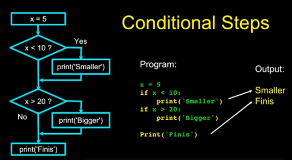

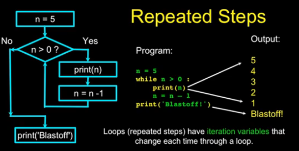

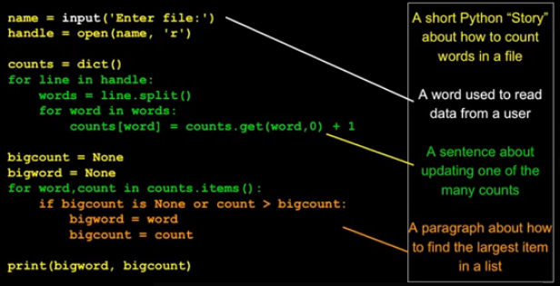

## variables expressions and statements

> constants fixed values  
> variables name rule, mnemonic  
> operator precedence: parenthesis, power, multi, add, left->right  
> `type()`  
> float + int, division  
> `int()`, `float()`  
> `input()` return string  
> `#` comment

## Comparion

> Comparison < <= > >= == !=  
> Indentation 4 spaces, Begin/end block  
> One-way decision, two-way decisions, multi-way, nested.  

```py
if x < 2:
    print('Below 2')
elif x >= 2:
    print('Two or more')
else:
    print('Something else')
```

> danger code on `try` and `except`

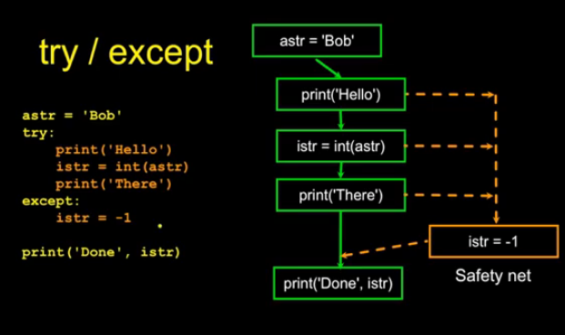

## Function

> Stored (and reused) steps.

```py
def hello():
    print('hello')
hello()
```

> Built-in functions `min()`, `max()`  
> Function that we define ourselves  
> Arguments and Parameters
> Void function

```py
def greet(lang):
    if lang == 'es':
        return 'Hola'
    elif lang == 'vn':
        return 'Xin Chao'
    else:
        return 'Hello'
print(greet('vn'), 'Shine')
```

## Loop

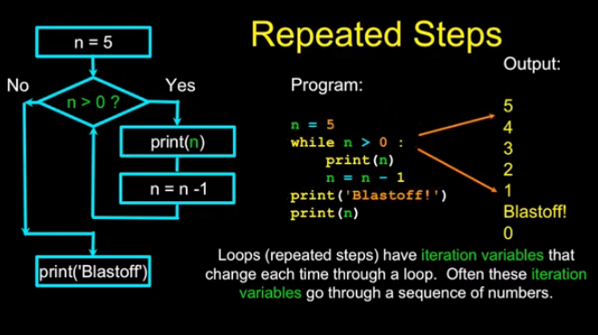

```py
while True:
    line = input('> ')
    if line[0] == '#':
        continue
    if line == 'done':
        break
    print(line)
print('Done!')
```

> definite loops iterate through members of a set

```py
for n in [5,4,3,2,1]:
    print(n)
```

```py
largest_so_far = -1
print('Before', largest_so_far)
for num in [9, 41, 12, 3, 74, 15]:
    if num > largest_so_far:
        largest_so_far = num
    print(largest_so_far, num)
print('After', largest_so_far)
```

> Count, Total, Average, Find  
> `is` and `is not`

## String

> `+` concat
> square brackets
> `len()`

```py
fruit = 'banana'
for letter in fruit:
    print(letter)
```

```py
s = 'Monty Python'
print(s[3:8])
'M' in s
```

> `dir()`: `lower`, `upper`, `find`, `replace`, `lstrip`, `rstrip`, `strip`, `startswith`  
> all string is Unicode

## Reading Files

```py
handle = open(filename, mode)
```

> return a handle(TextIOWrapper) use manipulate the file, mode `r` and `w`
> newline `\n`

```py
fname = input('> Enter the file name: ')
try
    fhand = open(filename)
except
    print('Fine cannot open')
    quit()

content = fhand.read()
for line in fhand:
    line = line.rstrip()
    if line.startswith('From'):
        print(line)
```

## List

> Programing: Algorithms and Data Structures  
> Strings are immutable, Lists are mutable  
> `range(4)`  
> `+` concat and slice like the strings

```py
stuff = list()
```

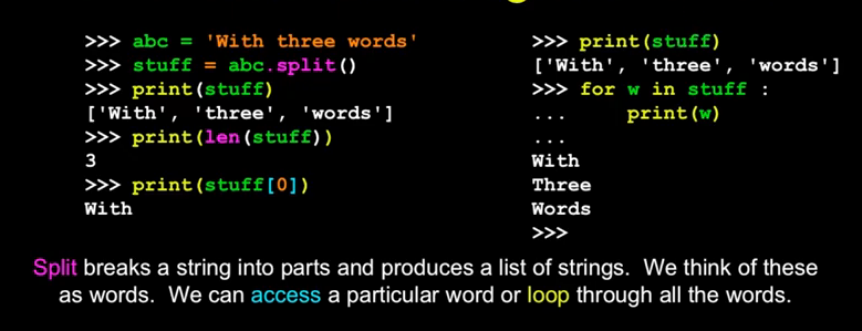

```py
fhand = open(filename)
for line in fhand:
    line = line.rstrip()
    if not line.startswith('From') : continue
    words = line.split()
    print(works[2])
```

## Dictionary

> Dictionary: label and List: order  

```py
counts = dict()
names = ['csev', 'cwen', 'csev', 'zquian', 'cwen']
for name in names:
    counts[name] = counts.get(name, 0) + 1
print(counts)
```

> `keys()`, `values()`, `items()`

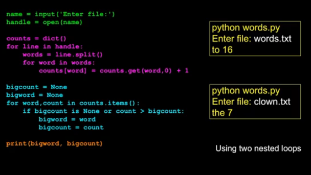

## Tuple

```py
l = list()
t = tuple()
(x, y) = (7, 'fred')
for (k,v) in d.items():
    print(k, v)
t = d.items()
```

> Compare Tuple

```py
t = sorted(d.items())

temp = list()
for (k,v) in d.items():
    temp.append((v, k))
temp = sorted(temp)
```

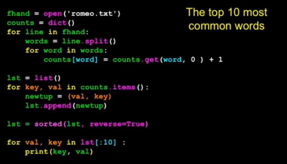

```py
print(sorted([(v, k) in for k, v in d.items()]))
```

## Regular Expression


```py
import re
```

> `re.search()`, `re.findall()`

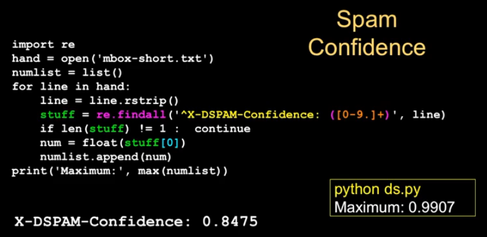

## Network

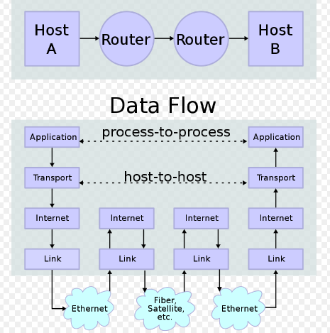

> TCP: Transport Control Protocol
> HTTP: HyperText Transper Protocol
> Protocol: A set of rules that all parties follow so we can predict each other's behavior  
> And not bump into each other

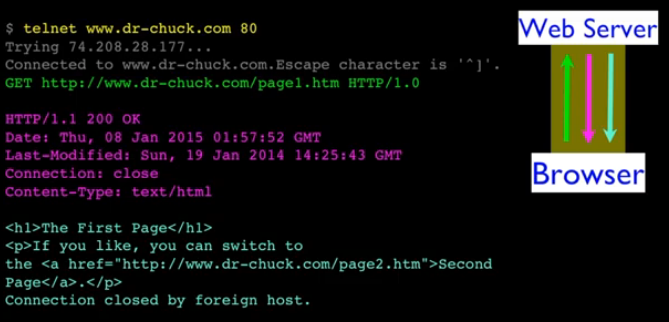

```py
import socket

mysock = socket.socket(socket.AF_INET, socket.SOCK_STREAM)
mysock.connect(('data.pr4e.org', 80))
cmd = 'GET http://data.pr4e.org/romeo.txt HTTP/1.0\n\n'.encode()
mysock.send(cmd)

while True:
    data = mysock.recv(512)
    if (len(data) < 1):
        break
    print(data.decode())
mysock.close()
```

## Text Process

> ASCII: 1 character, 8 bits, 1 byte; `ord()`, total 256  
> Unicode: > 10^9 character  
> UTF-8 1-4 byte recommended, UTF-16 Fixed length, UTF-32 Fixed length  
> string.encode and bytes.decode

## Urllib

```py
import urllib.request, urllib.parse, urllib.error

counts = dict()
fhand = urllib.request.urlopen('http://data.pr4e.org/romeo.txt')
for line in fhand:
    words = line.decode().split()
    for word in words:
        counts[word] = counts.get(word, 0) + 1
print(counts)
```

## Web scraping

> Support to pull data from web  
> Beautiful Soup `http://www.py4e.com/code3/bs4.zip`

```py
import urllib.request, urllib.parse, urllib.error
from bs4 import BeautifulSoup

url = input('Enter - ')
html = urllib.request.urlopen(url).read()
soup = BeautifulSoup(html, 'html.parser')

tags = soup('a')
for tag in tags:
    print(tag.get('href', None))
```

## XML and JSON

> Python Dictionary -> Serialize -> JSON, XML -> De-Serialize -> JavaHashMap  
> XML: Start-End Tag, Text Content, Attribute, Self Closing Tag  
> XML as Tree like DOM
> XML Document + XML Schema Contract = XML Validator
> XSD Structure

```xml
<xs:complexType name="person">
    <xs:sequence>
        <xs:element name="lastname" type="xs:string" />
        <xs:element name="age" type="xs:integer" />
        <xs:element name="dateborn" type="xs:date" />
        <xs:element name="country">
            <xs:simpleType>
                <xs:restriction base="xs:string">
                    <xs:enumeration value="FR" />
                    <xs:enumeration value="US" />
                </xs:restriction>
            </xs:simpleType>
        </xs:element>
    </xs:sequence>
</xs:complexType>
```

```py
import xml.etree.ElementTree as ET
data = '''<person>
    <name>Chuck</name>
    <phone type="intl">
        +1 734 303 4456
    </phone>
    <email hide="yes"/>
</person>'''

input = '''<stuff>
    <users>
        <user x="2">
            <id>001</id>
            <name>Chunk</name>
        </user>
        <user x="7">
            <id>009</id>
            <name>Shine</name>
        </user>
    </users>
</stuff>'''

tree = ET.fromstring(data)
print('Name:', tree.find('name').text)
print('Attr:', tree.find('email').get('hide'))
stuff = ET.fromstring(input)
lst = stuff.findall('users/user')
print('User count:', len(lst))
```

```py
import json
data = '''{
    "name": "Chuck",
    "phone": {
        "type": "intl"
        "number": "+1 734 303 4456"
    },
    "email": {
        "hide": "yes"
    }
}'''

info = json.loads(data)
```

> Json represents data as nested lists and dictionaries

## API

> Service Orient Approach(API)  
> Multi Systems

```py
import urllib.request, urllib.parse, urllib.error
import json

serviceurl = 'http://maps.googleapis.com/maps/api/geocode/json?'

while True:
    address = input('Enter location: ')
    if len(address) < 1: break

    url = serviceurl + urllib.parse.urlencode({'address': address})

    print('Retriveving', url)
    uh = urllib.request.urlopen(url)
    data = uh.read().decode()
    print('Retriveving', len(data), 'characters')

    try:
        js = json.loads(data)
    except:
        js = None

    if not js or 'status' not in js or js["status"] !== 'OK':
        print('==== Failure To Retriveving ====')
        print(data)
        continue

    lat = js["results"][0]["geometry"]["location"]["lat"]
    lng = js["results"][0]["geometry"]["location"]["lng"]
    print('lat', lat, 'lng', lng)
    location = js["results"][0]["formatted_address"]
    print(location)
```

API is not free(protocol and limit for access)

```py
import urllib.request, urllib.parse, urllib.error
import json
import twurl

TWITTER_URL = 'https://api.twitter.com/1.1/friends/list.json'

while True:
    print('')
    acct = input('Enter Twitter Account:')
    if (len(acct) < 1): break
    url = twurl.augment(TWITTER_URL, {"screen_name": acct, "count": "5"})

    print('Retrieving', url)
    connection = urllib.request.urlopen(url)
    data = connection.read().decode()
    headers = dict(connection.getheaders())
    print('Remaining', headers["x-rate-limit-remaining"])
    js = json.loads(data)
    print(json.dumps(js, indent=4))

    for u in js["users"]:
        print(u["screen_name"])
        s = u["status"]["text"]
        print('   ', s[:50])

### hidden.py

def oauth():
    return {
        "consumer_key": "h7Lu...Ng"
        "consumer_secret": "defe...MN"
        "token_key": "44234...2f2"
        "token_secret": "3829...32f"
    }

### twurl.py

import urllib
import oauth
import hidden

def augment(url, parameters)
    secrets = hidden.oauth()
    consumer = oauth.OAuthConsumer(secrets["consumer_key"], secrets["consumer_secret"])
    token = oauth.OAuthToken(secrets["token_key"], secrets["token_secret"])
    oauth_request = oauth.OAuthRequest.from_consumer_and_token(consumer, token=token, http_method='GET', http_url=url, parameters=parameters)
    oauth_request.sign_request(oauth.OAuthSignatureMethod_HMAC_SAH1(), consumer, token)
    return oauth_request.to_url()
```

## Object

> Input -> Process -> Output

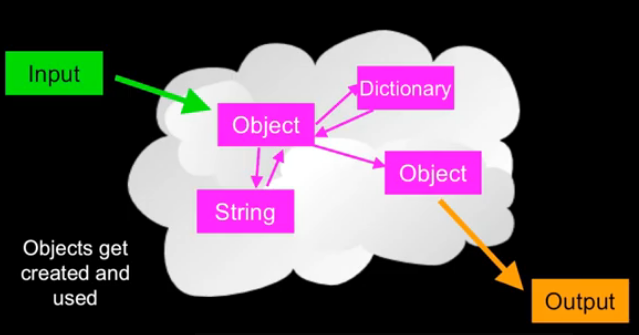

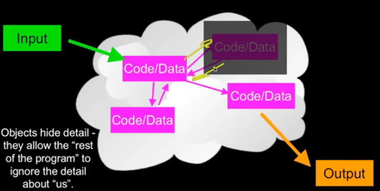

* Class  
* Method or Message  
* Field or attribute  
* Object or Instance

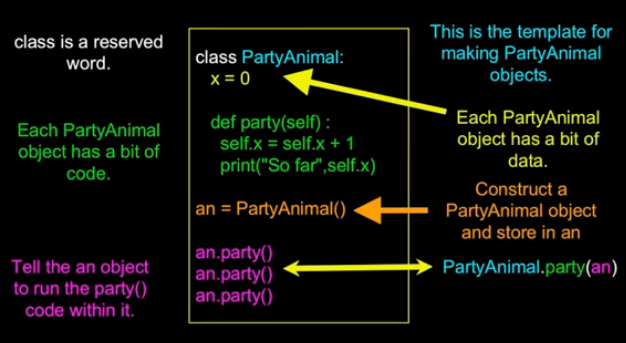

> `dir()` and `type()`  
> `constructor` and `destructor`(seldom)

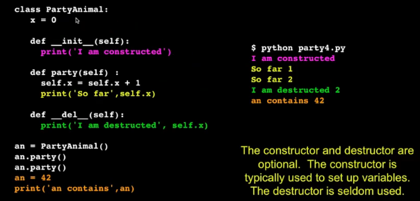

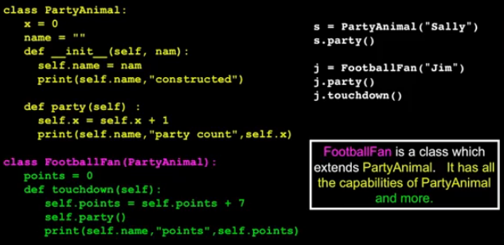

## Database

> [DB Browser for SQLite](https://sqlitebrowser.org)  
> Sort data -> Relational Database

* Database  
* Relation  
* Tuple (or row)  
* Attribute (also column or field)

> Structured Query Language

* Create a table  
* Retrieve some data  
* Insert data  
* Delete data


> Database Model(Schema)

```sql
CREATE TABLE "Users" ("name" TEXT, "email" TEXT)

INSERT INTO Users (name, email) VALUES ("Chuck", "csev@umich.edu")
DELETE FROM Users WHERE email="csev@umich.edu"
UPDATE Users SET name="Chales" WHERE email="csev@umich.edu"
SELECT * FROM Users WHERE email="csev@umich.edu"
SELECT * FROM Users ORDER BY email DESC
```

> Don't put the same string data in twice - use a relationship instead  
> Define Objects -> Relationship between them

### Database Normalization 3NF

* Do not replicate data  
* integers for keys

> Key

* Primary key  
* Logical key  
* Foreign key

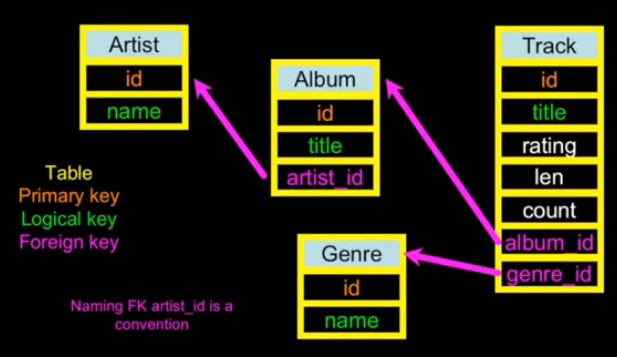

```sql
CREATE TABLE Album ("id" INTEGER PRIMARY KEY AUTOINCREMENT NOT NULL UNIQUE, "name" TEXT)
SELECT Track.title, Genre.name FROM Track join Genre ON Track.genre_id = Genre.id
```

> without `join` = cross join

```sql
CREATE TABLE User ("id" INTEGER PRIMARY KEY AUTOINCREMENT NOT NULL UNIQUE, "name" TEXT, email TEXT)
CREATE TABLE Course ("id" INTEGER PRIMARY KEY AUTOINCREMENT NOT NULL UNIQUE, "title" TEXT UINQUE)
CREATE TABLE Member ("user_id" INTEGER, "course_id" INTEGER
    role INTEGER
    PRIMARY KEY(user_id, course_id)
)
```

> reduces the amount of data which must be scanned.
> Indexes improve access performance for things like string fields
> Constraints on data
> Transactions allow SQL operations to be grouped and done as a unit

## Visualizing data

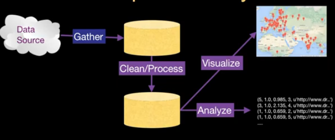

[hadoop](https://hadoop.apache.org)  
[spark](https://spark.apache.org)  
[redshift](https://aws.amazon.com/redshift)

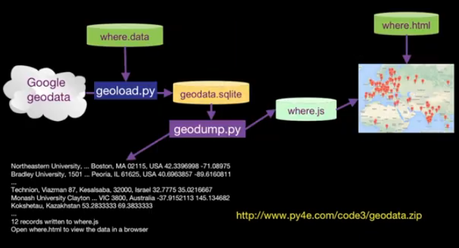

> Most data needs to be cleaned before using it.

### Google Architecture

* Web Crawling  
* Index Building  
* Searching

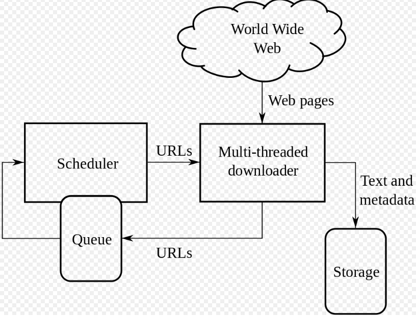

> Index: It determines which pages are most highly connected

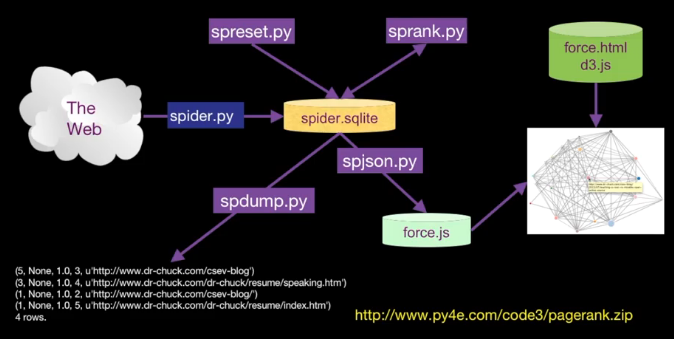

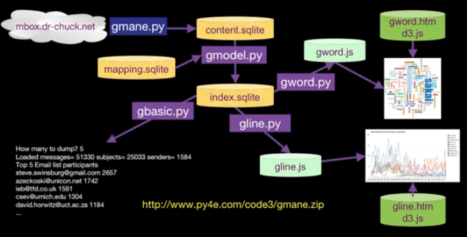
