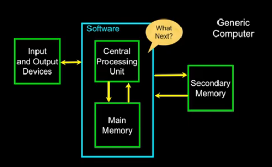

# computer-science

## Why Program

* computer want to be helpful  
* programers anticipate needs  
* users and programers  
* why be a programer  
  * to get some task done - we are the user and programer  
  * to product something for others use - a programing job  
* what is code? software? a program?  
  * a sequence of stored instructions  
  * a piece of creative art  
* programs for humans  
* programs for Python

## Hardware Architecture



> binary stream ~ programing language

## Python

> it is easier for you to learn Python than for the computer to learn English


### Element

* Vocabulary/Words: Variable Operator Constant Reserved-Word  
* Sentence structure -> Interactive  
* Story structure -> Script


## variables expressions and statements

> constants fixed values  
> variables name rule, mnemonic  
> operator precedence: parenthesis, power, multi, add, left->right  
> `type()`  
> float + int, division  
> `int()`, `float()`  
> `input()` return string  
> `#` comment

## Comparion

> Comparison < <= > >= == !=  
> Indentation 4 spaces, Begin/end block  
> One-way decision, two-way decisions, multi-way, nested.  

```py
if x < 2:
    print('Below 2')
elif x >= 2:
    print('Two or more')
else:
    print('Something else')
```

> danger code on `try` and `except`


## Function

> Stored (and reused) steps.

```py
def hello():
    print('hello')
hello()
```

> Built-in functions `min()`, `max()`  
> Function that we define ourselves  
> Arguments and Parameters
> Void function

```py
def greet(lang):
    if lang == 'es':
        return 'Hola'
    elif lang == 'vn':
        return 'Xin Chao'
    else:
        return 'Hello'
print(greet('vn'), 'Shine')
```

## Loop


```py
while True:
    line = input('> ')
    if line[0] == '#':
        continue
    if line == 'done':
        break
    print(line)
print('Done!')
```

> definite loops iterate through members of a set

```py
for n in [5,4,3,2,1]:
    print(n)
```

```py
largest_so_far = -1
print('Before', largest_so_far)
for num in [9, 41, 12, 3, 74, 15]:
    if num > largest_so_far:
        largest_so_far = num
    print(largest_so_far, num)
print('After', largest_so_far)
```

> Count, Total, Average, Find  
> `is` and `is not`

## String

> `+` concat
> square brackets
> `len()`

```py
fruit = 'banana'
for letter in fruit:
    print(letter)
```

```py
s = 'Monty Python'
print(s[3:8])
'M' in s
```

> `dir()`: `lower`, `upper`, `find`, `replace`, `lstrip`, `rstrip`, `strip`, `startswith`  
> all string is Unicode

